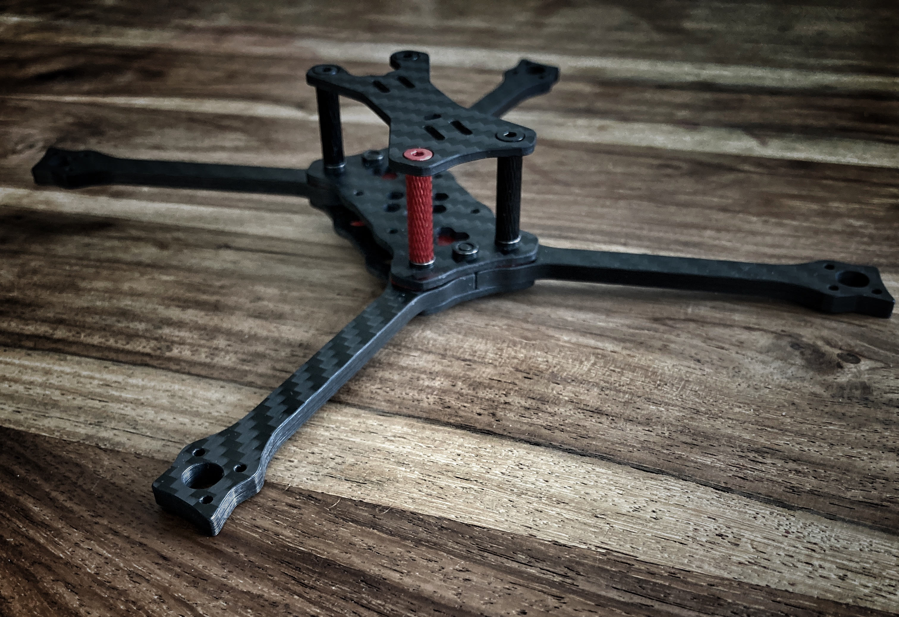
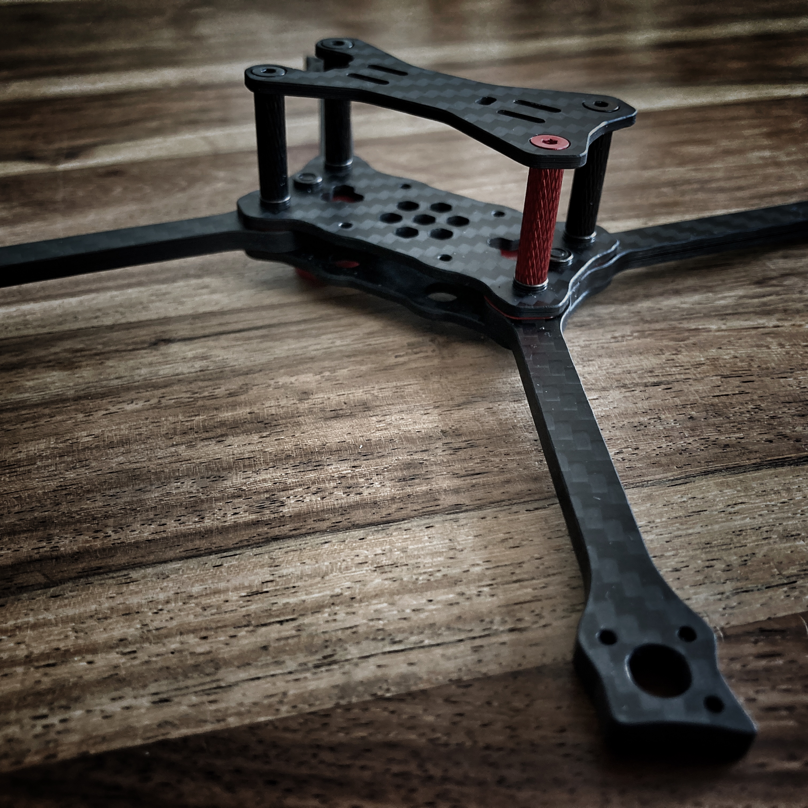
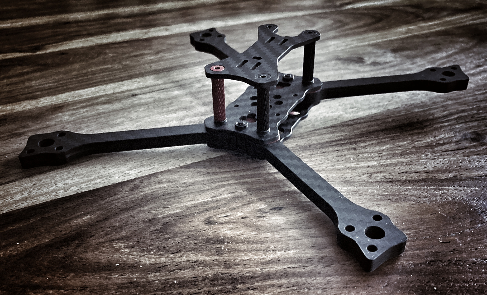
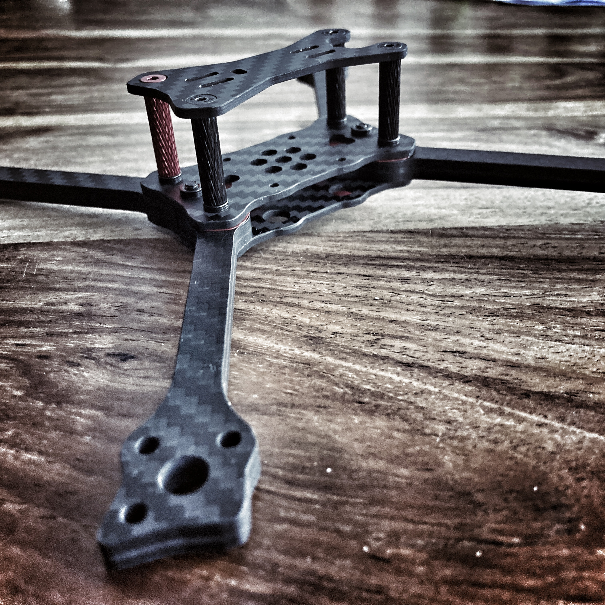

# FYUZ - FPV Open Source 5" Race Frame

Bau dir deinen eigenen Race Copter für 16mm oder 12mm Lochkreis Motoren mit dem FYUZ Rahmenset. Die Carbon-Bauteile sind mit geringst möglichem Herstellungsaufwand zu produzieren.  

## Frame-Spec
* Propbase: 5"  
* Bottomplate: 2mm
* Midplate: 2mm
* Toplate: 2mm
* Armhook: 2mm or 3mm
* Arms: 4mm or 5.5mm
* AIO-Mount: 2mm, for M2, for 25.5 x 25.5 AIO Boards
* Lipopad: 2mm Moosgummi
* Stack mounting: 20 x 20 (for M2 or M3 screws)
* Standoff distance: 20mm
* Weight 5" with 20mm Alu Standoffs:  
  * with 4mm Arms for Motormount 12mm: 43.5g  
  * with 5.5mm Arms for Motormount 16mm: 56.2g  

## Carbon Parts

### 2mm Plate
* Bottomplate-H2.0.dxf  
* Midplate-M2-Stack-H2.0.dxf  
* Midplate-M3-Stack-H2.0.dxf  
* Topplate-H2.0.dxf  
* AIO-Mount-M2-StackMount-H2.0.dxf  
* Armhook-H2.0.dxf (Motormount 12mm)  

### 3mm Plate
* Armhook-H3.0.dxf (Motormount 16mm)  

### 4mm Arms
* 4x-715.70-H4.0.dxf (Motormount 12mm)  

### 5.5mm Arms
* 4x-720.76-H5.5.dxf (Motormount 16mm)  

## Buy Carbon - only Top producer/dealer
* [AHLtec](https://www.ahltec.de/shop/de/); optional mit Fräs-Service - Germany  
* [www.ikabon.com](https://www.ikabon.com); [email, Wendy Chan](mailto:info@ikabon.com) - China  
* [www.jinjiuyi.net](http://www.jinjiuyi.net); [email](mailto:info@jinjiuyi.net) - China  

## Laser Parts
* LipoPad.dxf

## Screws & Nuts

* countersunk head screw 4x M3 x 16  
* countersunk head screw 4x M3 x 6  
* pressnut 6x M3; [Buy](https://www.copterfarm.de/einpressmuttern-m3-10er-set-521.html) - Germany  

### For Fyuz Sub300 - Motormount 12mm
* countersunk head screw 2x M3 x 10

### For Fyuz - Motormount 16mm
* countersunk head screw 2x M3 x 12

### For AIO Mount
* lens head screw 4x M2 x 12 | 8 | 6

# Betaflight Presets - EXPERIMENTAL
* [BF 4.3 Presets for FyuzS300](https://github.com/moorfpv/betaflight-presets)
* [How to use Presets](https://betaflight.de/docs/knowledge-base/hintergrundwissen/betaflight-presets/)

# License

This work (DXF-Files) is licensed under a [Creative Commons (4.0 International License) Attribution - NonCommercial - Share Alike](https://creativecommons.org/licenses/by-nc-sa/4.0/deed.en).  

✖ | Sharing without ATTRIBUTION  
✔ | Remix Culture allowed  
✖ | Commercial Use  
✖ | Free Cultural Works  
✖ | Meets Open Definition  

# See also
* [Fyuz S300 Printables](https://www.printables.com/model/322457-sub300fpv-fyuz/files)  
* [screwsandmore](https://www.screwsandmore.de/en) - Germany  
* [five33 Printables](https://www.printables.com/model/243738-five33-lightswitch)  

---

* Arms: 4mm  
* Armhook: 2mm
* Weight 5" with 20mm Alu Standoffs: 43.5g  

Sources: [Arm-Parts/Motormount-12mm](https://github.com/moorfpv/fpv-race-frame-fyuz/tree/master/Arm-Parts/Motormount-12mm)  

---

---

---  
---  

* Arms: 5.5mm  
* Armhook: 3mm
* Weight 5" with 20mm Alu Standoffs: 56.2g  

Sources: [Arm-Parts/Motormount-16mm](https://github.com/moorfpv/fpv-race-frame-fyuz/tree/master/Arm-Parts/Motormount-16mm)  

---

---

